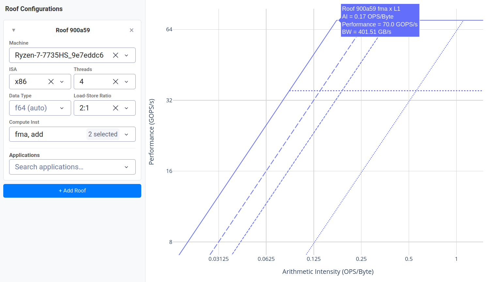
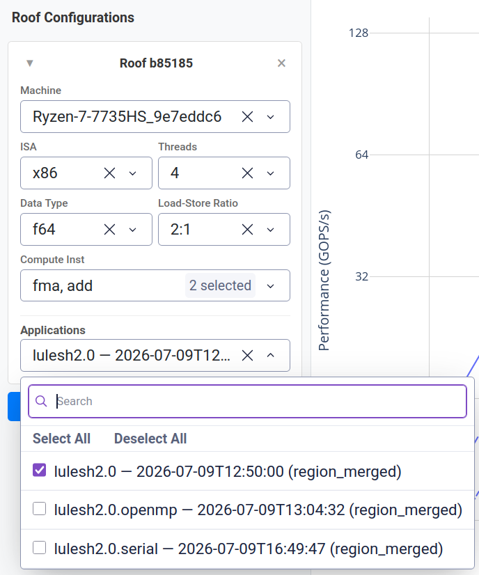
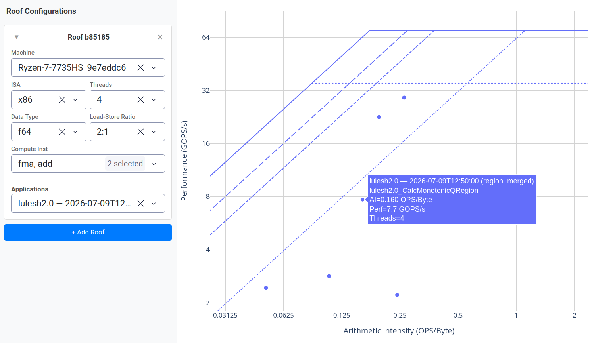

# Quick Start

This guide walks through a complete CARM workflow: benchmarking your machine to create its CARM, launching the GUI, profiling an example application, and interpreting the results.

---

## 1. Benchmark your system

Run the full roofline benchmark, which measures peak compute performance and memory bandwidth at every cache level for your machine.

You can specify different benchmark parameters (data type, thread count, etc.) for the run. These parameters were chosen to match the example application in this guide.

```bash
# Double-precision, 1, 2, and 4 threads (ISAs are automatically detected)
carm benchmark --data-type f64 --threads 1 2 4
```

{: .tip}
For a faster first run, use `--test-time 5` (5 seconds per measurement instead of the default 25). Accuracy degrades, but the shape will be visible.

This produces a single results directory containing roofline data for all three thread configurations. The results go to your user data directory (e.g. `~/.local/share/carm/` on Linux), but you don't need to open it manually — `carm gui` will automatically find them.

See the [Benchmarking](benchmark) page for the full set of options.

---

## 2. Launch the GUI

```bash
carm gui
```

Open the printed URL (default: [http://127.0.0.1:8050](http://127.0.0.1:8050)) in your browser.


### Select the roof

The GUI automatically loads the roofline data from your benchmark run. You can now choose a roof — use the dropdowns on the left to select the machine, ISA, data type (`f64`), thread count, and compute instructions for the roof lines.

Your roof lines (one per cache level) and compute-performance ceilings appear on the plot. You can hover over each of the ridge points and see the associated arithmetic intensity, performance and bandwidth.



{: .tip }
Create multiple roofs (use the **+ Add Roof** button) to compare the performance of different thread counts side by side. Each roof appears in a different colour.

---

## 3. Compile the example application

The repository includes a [PAPI-instrumented fork of LULESH 2.0](https://github.com/LLNL/LULESH) under [`examples/lulesh-papi/`](https://github.com/champ-hub/carm-roofline/tree/dev/examples/lulesh-papi).

First, check OpenMP is available on your compiler. If not, you can still build the serial variant of LULESH. Optionally, you may build an MPI variant if you have an MPI implementation installed.

### All three variants available (MPI + OpenMP + Serial)

```bash
cd examples/lulesh-papi
make openmp # builds lulesh2.0.openmp
# Optional: build with MPI support
make mpi    # builds lulesh2.0 (MPI + OpenMP)
# Optional: build single-thread variant (no OpenMP)
make serial # builds lulesh2.0.serial
```

All build variants link `-lpapi` (required by the PAPI instrumentation added in this fork).

{: .note }
If `libpapi` development headers are not installed, install them via your package manager or from source. A source build is recommended, as older versions of PAPI may not support the hardware counters on recent hardware.

---

## 4. Profile the application

Before profiling, you need to make sure your system allows performance counter access. To enable it, you can run:

```bash
sudo sysctl kernel.perf_event_paranoid=0
```

To profile LULESH, use the `carm profile` command. This runs the application and collects PAPI metrics. For simplicity, 4 OpenMP threads are used:

```bash
OMP_NUM_THREADS=4 carm profile \
    --aggregation region_merged \
    --data-type f64 \
    -- examples/lulesh-papi/lulesh2.0 -s 20
```

Optionally, you can run it under MPI with:

```bash
OMP_NUM_THREADS=4 carm profile \
    --aggregation region_merged \
    --data-type f64 \
    -- mpirun -np 1 examples/lulesh-papi/lulesh2.0 -s 20
```

{: .note-title }
> Flags explained
>
> - `--aggregation region_merged` — merges multiple occurrences of the same region across threads/ranks into a single point per region. See the [Profiling](profile) reference for other aggregation modes.
> - `--data-type f64` — tells the metric resolver the code uses double-precision (matching LULESH's `Real_t = double`)
> - The `-s 20` is a LULESH flag: it sets the problem size to 20

The output will show per-region metrics like:

```
lulesh2.0_EvalEOS_setup: AI=0.052 FLOP/Byte, 2.443 GFLOP/s, 46.980 GB/s, 0.105s
lulesh2.0_LagrangeNodal: AI=0.242 FLOP/Byte, 2.204 GFLOP/s, 9.118 GB/s, 0.806s
lulesh2.0_UpdateVolumes: AI=0.117 FLOP/Byte, 2.930 GFLOP/s, 24.947 GB/s, 0.002s
```

{: .tip-title }
> Instrumenting your own application
>
> To add PAPI regions to your own application, read the [Instrumenting Your Application](profile#instrumenting-your-application) guide. The key rule: **every thread** that does parallel work must call `PAPI_hl_region_begin`/`end` from **inside** the `#pragma omp parallel` block.  Wrapping outside the parallel block captures only the master thread, producing misleading results.

---

## 5. Visualise in the GUI

Restart the GUI (from step 2) and refresh the page:

```bash
carm gui
```

The GUI automatically scans for new profiling results in the results directory.

### Select the application

1. In the **Applications** panel, select `lulesh2.0` (or your binary's name) from the dropdown. Each PAPI-annotated region appears as a point on the roofline.
2. **Pick the matching roof** — set the roof dropdown's thread count to **4** (matching your profiling run), ISA to x86 (scalar), and data type to `f64`.



### Hover over the points

If you hover over a point, the tooltip shows the region name and a series of metrics.



---

## 6. Interpret the results

Based on its position relative to the roofline, a region's performance characteristics can be analyzed, giving you insight into how to optimize it.

| Position | Meaning | What to do |
|---|---|---|
| **On or near the compute ceiling** | Compute-bound — the kernel achieves peak FLOP/s for the available threads/ISA. | Vectorize the code and/or increase thread count. |
| **Below a memory-bandwidth ceiling** | Memory-bound — performance is likely limited by data movement from that memory level. | Improve data locality, use a cache-friendly data layout, or restructure the loop to reduce traffic. Increased thread count can help if that memory level isn't saturated yet. |
| **Far below either ceiling** | Latency-bound or serialisation overhead — the kernel is not exploiting the hardware's throughput capacity. | Inspect the generated code for pipeline stalls, long-latency instructions, or insufficient ILP. |

The **arithmetic intensity** (x-axis, FLOP/Byte) is a key metric: higher is usually better, making memory bottlenecks less likely.

{: .note-title }
> Rule of Thumb
>
> If your region is memory-bound (left of the L1 ridge point), any optimisation that reduces data movement helps more than adding compute throughput. If it is compute-bound (right of the ridge point), improving parallelism or using wider vector instructions moves the point up.

---

## Next steps

- Read the [Benchmarking](benchmark) reference for custom ISAs, data types, and memory-sweep tests.
- Read the [Profiling](profile) reference for PAPI vs `perf` backend details and advanced aggregation modes.
- Read the [GUI](gui) reference for controls and customization features.
